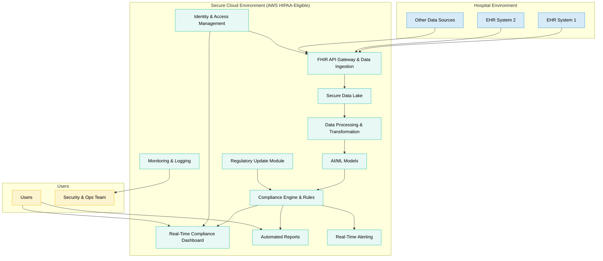
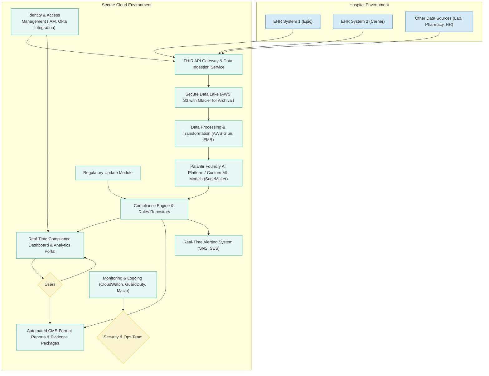

**ComplianceGuard AI: Next-Gen Accreditation Platform**

**Strategic Implementation Plan for The Joint Commission**

*Version 4.0 | May 2025*

---

## 0. Strategic Overview

ComplianceGuard AI offers a transformative approach to healthcare accreditation, using AI and ML to streamline compliance while upholding quality and safety. This plan details the strategic roadmap for developing, deploying, and improving the platform.

### Strategic Vision and Market Context

Healthcare compliance is transforming due to regulatory complexity and value-based care. With the compliance software market at \$4.3 billion and a 12.2% growth rate, ComplianceGuard AI is a leading solution in this evolving space. The market opportunity grows with 75% of compliance teams exploring or using AI.

### Technical Architecture and Implementation

The platform's architecture focuses on modularity, scalability, and security, using AWS HIPAA-eligible services and open standards. It integrates with EHR systems via FHIR APIs, creating a comprehensive compliance ecosystem.



The architecture diagram showcases the three interconnected environments of the ComplianceGuard AI system:

1. **Hospital Environment**: Multiple EHR systems and data sources feed compliance information into the platform.
2. **Secure Cloud Environment**: Powers core functionality with key components:
   - FHIR API Gateway securely ingests and standardizes data.
   - Secure Data Lake stores sensitive healthcare information.
   - AI/ML Models analyze patterns and predict compliance issues.
   - Compliance Engine applies current accreditation standards.
   - Real-time Dashboard visualizes compliance status.
3. **Users**: Includes everyday platform users and security/operations teams maintaining system integrity.

Data flows securely from hospital systems through the FHIR API Gateway, processed and analyzed by AI models, then presented via the compliance dashboard. Security is ensured with Identity & Access Management and continuous monitoring.

### Implementation Phases and Timeline

The development process spans four phases:

1. **Phase 0: Planning & Design (Completed Q2 2025)**
   - Requirements gathering and user story mapping
   - Solution architecture
   - Ethical AI framework finalization
   - Team setup and partner engagement
2. **Phase 1: Foundation & Core Infrastructure (Q3-Q4 2025)**
   - AWS HIPAA-compliant environment setup
   - Secure data lake implementation
   - Basic FHIR API development
   - Identity and access management
3. **Phase 2: Core AI Development & Feature Prototyping (Q1-Q2 2026)**
   - AI/ML model development for predictive compliance
   - Compliance engine development
   - Real-time alert system prototyping
   - Dashboard development
4. **Phase 3: Pilot Program & Validation (Q3-Q4 2026)**
   - Pilot deployment with Tampa General Hospital
   - AI model refinement with real data
   - Full feature implementation
   - HITRUST CSF certification preparation

### Key Performance Indicators (KPIs)

Success will be measured by these metrics:

1. **Business Metrics**
   - 30-40% reduction in hospital audit and accreditation costs
   - 90-95% inter-rater reliability for key standards
   - Faster accreditation decision turnaround
   - 75% increase in proactive risk identification
   - 20% market penetration within 2 years
2. **Technical KPIs**
   - > 93% F1-Score for citation prediction
   - < 2 seconds P95 API latency
   - 99.9% data anomaly detection coverage
   - 99.95% system uptime
   - > 99.5% data ingestion success rate

### Risk Management and Ethical Safeguards

Our platform uses comprehensive risk management strategies:

1. **AI Model Risks**
   - Continuous monitoring for model drift
   - Regular bias detection and mitigation
   - Explainability requirements
   - Human oversight mechanisms
2. **Data Security & Privacy**
   - HIPAA compliance via AWS-eligible services
   - End-to-end encryption (AES-256 at rest, TLS 1.2+ in transit)
   - Audit trails
3. **Role-based access controls**

- **Operational Risks**
  - High-availability architecture
  - Automated failover
  - Regular security assessments
  - Backup and disaster recovery

### URAC AI Accreditation Alignment

The platform aligns with URAC's AI Accreditation standards (expected Q3 2025), including:

- Data privacy and patient consent
- Bias detection and mitigation
- Clinical oversight and provider training
- Interoperability and governance

This positions ComplianceGuard AI as a transformative healthcare accreditation solution, combining AI capabilities with robust security and compliance frameworks for a more efficient, accurate, and reliable process.

---

## 1. Executive Summary

**Initiative Name**: Project Sentinel+ (ComplianceGuard AI)

**Elevator Pitch**: "ComplianceGuard AI is a transformative, AI-driven platform revolutionizing healthcare accreditation. By automating and streamlining compliance workflows, it cuts manual efforts by over 40%, enhances survey accuracy, and prevents up to 93% of potential CMS penalties through predictive compliance analytics. This lets healthcare providers focus on patient care while ensuring high standards."

**The Challenge**: Healthcare organizations face a complex, resource-intensive accreditation landscape. Manual processes are inefficient, error-prone, and can't keep up with regulatory changes, leading to administrative burdens, costs, and diverting focus from patient care. The Joint Commission (TJC) struggles with inter-surveyor reliability and logistical demands.

**Our Solution**: ComplianceGuard AI uses AI, ML, and NLP for a dynamic, real-time compliance ecosystem. It integrates with EHR systems via FHIR APIs to analyze data, identify compliance gaps, predict risks, and offer insights. It provides automated evidence collection, document management, regulatory monitoring, and AI-assisted survey tools.

**Value Proposition & Revenue Impact**:

- **For Healthcare Providers (Clients)**:
  - **Reduced Operational Costs**: Cuts staff hours for accreditation prep, audit management, and data collection, boosting the bottom line.
  - **Penalty Avoidance**: Identifies non-compliance issues to minimize CMS fines and protect revenue.
  - **Improved Patient Safety & Quality**: Ensures compliance with best practices, enhancing care, outcomes, and hospital reputation.
  - **Accelerated Accreditation Cycles**: Speeds up evidence gathering and submission for quicker accreditation benefits.

**For The Joint Commission (TJC)**:

- **New Revenue Stream**: Offers ComplianceGuard AI as a premium service, generating new, recurring revenue.
- **Enhanced Surveyor Efficiency**: AI tools pre-analyze data and standardize assessments, boosting survey efficiency and cutting costs.
- **Market Leadership & Differentiation**: Positions TJC as an innovator, attracting more healthcare organizations.
- **Data-Driven Insights**: Provides insights into compliance trends and risks, enhancing TJC's value proposition.

**Release Target**: Q3 2026 (General Availability). Pilot with select hospitals starts Q1 2026.

**Status**: Phase 2/4 (Core AI Development & Initial Feature Prototyping)

**Strategic Alignment**:

- Supports TJC's 2025 Zero Harm Initiative by identifying and mitigating patient harm risks.
- Complies with URAC's forthcoming AI Accreditation standards (Q3 2025), ensuring ethical and operational benchmarks.
- Aligns with HHS AI Strategic Plan Goals 1 (Trustworthy AI) & 2 (Responsible AI Use), focusing on ethical development, bias mitigation, and transparency.
- Highlights the urgent need for strong AI governance in healthcare, as shown in the "AI Compliance Blueprint" video. The blueprint focuses on five key components: risk assessment, policy development, enforcement mechanisms, staff training, and continuous monitoring \[Source: Analysis of YouTube link: `https://www.youtube.com/watch?v=OtBdwDsrXdA`].

---

## 2. Objectives & Success Metrics

### 2.1 Business Goals

This section outlines the main business objectives for ComplianceGuard AI, detailing its impact on both TJC and client healthcare organizations. These goals are strategically linked to fulfill our mission and ensure financial sustainability.

| Objective                                        | Target Impact                                                                                     | Measurement Method(s)                                                                                                    | Strategic Rationale & Revenue Link                                                                                                                                         |
| ------------------------------------------------ | ------------------------------------------------------------------------------------------------- | ------------------------------------------------------------------------------------------------------------------------ | -------------------------------------------------------------------------------------------------------------------------------------------------------------------------- |
| **Reduce Hospital Audit & Accreditation Costs**  | Cut 30-40% of accreditation preparation costs for client hospitals by Q4 2026.                    | Surveys of hospital administrators; Case studies on resource allocation; Analysis of audit budgets.                      | Addresses a major hospital pain point, making TJC accreditation more appealing. Cost savings can be captured as revenue through strategic pricing.                         |
| **Improve Survey Consistency & Reliability**     | Attain 90-95% inter-rater reliability for key standards among surveyors with AI tools by Q2 2027. | Statistical analysis of survey findings; Blinded reviews of AI versus traditional methods.                               | Enhances accreditation credibility and fairness. Consistency reduces disputes, lowering TJC's costs, and strengthens brand value, aiding client retention and acquisition. |
| **Accelerate Accreditation Decision Turnaround** | Cut decision time from 72 to <24 hours by Q4 2026.                                                | Track timestamps in the workflow system; Automated reporting on decision times.                                          | Faster decisions offer quicker assurance, serving as a competitive edge for TJC and enabling more accreditations with existing resources.                                  |
| **Enhance Proactive Risk Identification**        | Enable hospitals to identify 75% more potential risks proactively within 12 months.               | Track AI-flagged risks addressed versus historical findings; Correlation analysis of platform use and finding reduction. | Supports patient safety and quality (Zero Harm). Reduces costly incidents, strengthening the platform's value and supporting premium pricing and wider adoption.           |
| **Achieve Significant Market Penetration**       | Secure adoption by 20% of TJC-accredited hospitals in 2 years; 40% in 4 years.                    | Track sales and subscriptions; Market share analysis.                                                                    | Drives revenue through subscriptions. A larger user base enhances AI models, enabling new data-driven products/services and potential future revenue.                      |
| **Establish New Revenue Stream for TJC**         | Generate \$X million in annual recurring revenue from subscriptions by Year 3 post-GA.            | Financial reports on subscription revenue; CAC and LTV analysis.                                                         | Diversifies revenue, reducing reliance on traditional fees. Offers a scalable model that grows with adoption and feature expansion.                                        |
| **Decrease CMS & Other Penalties for Clients**   | Achieve a 50% reduction in CMS and other penalties for client hospitals within 2 years.           | Aggregated data on penalty incidents and costs, compared to benchmarks.                                                  | Provides a quantifiable financial benefit, justifying platform investment. Success will drive broader adoption and increase revenue.                                       |

### 2.2 Technical KPIs

These KPIs measure the platform's technical robustness, reliability, and effectiveness. They track system performance against benchmarks and highlight areas for improvement.

| Metric                                      | Benchmark                                                                                                               | Measurement Method(s)                                                                                                                   | Strategic Rationale & Impact                                                                                                                             |
| ------------------------------------------- | ----------------------------------------------------------------------------------------------------------------------- | --------------------------------------------------------------------------------------------------------------------------------------- | -------------------------------------------------------------------------------------------------------------------------------------------------------- |
| **AI Model Accuracy (Citation Prediction)** | >93% F1-Score in predicting potential compliance citations across key standards.                                        | Back-testing with CMS citation data and TJC survey findings; Cross-validation on holdout datasets; Live A/B testing with expert review. | High accuracy is crucial for predictive compliance, impacting user trust and preventing penalties. It's foundational to our business case.               |
| **API Latency (FHIR Integration)**          | <2 seconds P95 for all critical API calls to EHR systems and internal services.                                         | Continuous monitoring via New Relic, AWS CloudWatch, or similar tools; Load testing for peak usage scenarios.                           | Low latency ensures seamless user experience, especially for real-time data and dashboard updates. Performance lags lead to user abandonment.            |
| **Data Anomaly & Threat Detection**         | 99.9% coverage and accuracy in detecting anomalous data patterns or security threats.                                   | AWS GuardDuty logs; IDS alerts; Regular penetration testing and vulnerability scans; Monitoring data access patterns using AWS Macie.   | Essential for data integrity and security, aligning with HIPAA requirements. A breach could devastate our reputation and finances.                       |
| **System Availability & Uptime**            | 99.95% uptime for all critical platform services.                                                                       | Real-time monitoring via Pingdom, UptimeRobot, and AWS CloudWatch; Automated alerts for service disruptions.                            | High availability is essential for a mission-critical system in compliance monitoring. Downtime disrupts hospital operations and TJC survey processes.   |
| **Regulatory Content Update Speed**         | <24 hours from official publication of regulatory changes to reflection in the platform's knowledge base and AI models. | Automated monitoring of regulatory feeds; Internal audit of update timestamps.                                                          | Swift updates ensure current compliance guidance, maintaining platform value and preventing reliance on outdated information.                            |
| **Scalability (User & Data Load)**          | System can handle a 300% increase in users and data volume from projected Year 1 load without performance degradation.  | Stress testing with JMeter or LoadRunner; Monitoring resource utilization under increasing load in AWS.                                 | Ensures platform growth without major re-architecture, critical for market penetration and long-term viability.                                          |
| **Data Ingestion Success Rate**             | >99.5% success for automated ingestion and processing of structured and unstructured data from EHRs and other sources.  | Monitoring logs for data ingestion pipelines; Error tracking and alerting for failed data transfers or transformations.                 | Reliable data ingestion is key for AI analytics. Failures result in incomplete or inaccurate compliance assessments.                                     |
| **User Adoption & Engagement**              | Key features used by >70% of active users weekly within 6 months of onboarding.                                         | Product analytics tracking feature usage, session duration, user pathways (e.g., Mixpanel, Amplitude, or custom logging).               | Shows platform is intuitive, useful, and becoming part of workflows. Low adoption signals usability issues, impacting subscription renewals and revenue. |

## 3. Strategic Alignment

### 3.1 Market Context & Opportunity

The healthcare compliance landscape is transforming due to regulatory complexity, value-based care, and digital tech adoption.

- **Massive and Growing Market**: The healthcare compliance software market, valued at **\$4.3 billion and growing at a 12.2% CAGR** \[4], signals strong demand for solutions like ComplianceGuard AI. The niche for accreditation-focused AI platforms is rapidly expanding.
- **AI Adoption is Accelerating**: About **75% of compliance teams are exploring or adopting AI solutions** \[2]\[12]. This trend shows a market open to AI-driven innovations, with early adopters seeking competitive advantages.
- **Pain Points of Manual Compliance**: Traditional methods are labor-intensive, costly, and prone to error. Hospitals spend millions on audits, training, and fees. ComplianceGuard AI addresses these issues.
- **Regulatory Pressure and Costs of Non-Compliance**: CMS penalties, OIG settlements, and reputational damage cost millions. In 2023, CMS penalties exceeded \$X billion. This creates a need for robust, predictive solutions.
- **Competitive Landscape**:
  - **Existing Compliance Software**: Vendors like RLDatix, Workiva, and NAVEX Global offer GRC software but lack specialization in accreditation standards and advanced AI capabilities.
  - **Niche AI Startups**: Startups are developing AI tools for healthcare niches but few offer comprehensive accreditation platforms.
- **In-House Solutions**: Larger systems may have internal tools, but they often lack the sophistication and scalability of ComplianceGuard AI.
- **TJC's Unique Advantage**: TJC's deep understanding of accreditation standards, relationships with healthcare organizations, and strong brand reputation provide a competitive edge. ComplianceGuard AI is positioned as the gold-standard solution, crafted by recognized accreditation experts.

**Opportunity for TJC**: Launching ComplianceGuard AI allows TJC to streamline processes and offer high-value services, solidifying its role as a leader in healthcare quality and safety, creating new revenue, and laying a foundation for future innovations.

### 3.2 Ethical Framework & Governance

ComplianceGuard AI will adhere to high ethical standards, ensuring fairness, transparency, accountability, and privacy. This framework is crucial for trust with users, patients, and regulators, incorporating principles from URAC AI standards, NIST AI RMF, HHS AI Strategy, and AI governance best practices.

- **Bias Detection and Mitigation**:
  - **Proactive Audits**: Monthly audits using toolkits like IBM AIF360, Google's What-If Tool, or Fairlearn will assess models for demographic biases in data, algorithms, and outputs.
  - **Representative Data Sets**: AI models will be trained on diverse datasets reflecting client hospital patient populations, prioritizing demographic balance.
  - **Algorithmic Adjustments**: If bias is detected, we'll use techniques like re-weighting, adversarial debiasing, or modifying algorithms without compromising accuracy.
  - **Transparency in Mitigation**: Documentation will detail detected biases and steps taken to mitigate them.
- **Transparency and Explainability (XAI)**:
- **Model Explanations**: For surveyors and hospital compliance officers, the platform offers clear explanations for its AI predictions and recommendations using SHAP or LIME, presented in user-friendly formats (e.g., "This standard is flagged as high-risk due to X, Y, and Z factors in your data").
  - **ONNX Model Exchange**: Using the ONNX format ensures model interoperability and transparency, allowing authorized technical teams to easily inspect and validate models.
  - **Documentation of Logic**: We'll document the AI's logic for interpreting and assessing standards, enhancing user understanding and trust.
- **Data Privacy and Security (Aligning with HIPAA & HITRUST)**:
  - **Robust Data Governance**: We'll enforce strict data governance policies for access, usage, storage, and retention in compliance with HIPAA, HITECH, and relevant regulations.
  - **Data Minimization**: We'll collect only the minimum data necessary for the AI's function.
  - **De-identification/Anonymization**: Where feasible, we'll de-identify or anonymize data before AI processing, maintaining stringent PHI safeguards per AWS HIPAA-eligible services.
  - **Encryption**: All data will be encrypted at rest (using AES-256 via AWS KMS) and in transit (using TLS 1.2+).
  - **Access Controls**: We'll use role-based access controls (RBAC) to limit data access to authorized personnel only.
  - **Audit Trails**: We'll maintain audit logs to track data access, system changes, and AI decision-making processes, related to "Enforcement" and "Monitor and Iterate" from the AI Compliance Blueprint video.
- **Consent Management**:
  - **Dynamic Patient Opt-In/Out**: For AI features processing identifiable patient data beyond standard operational/EHR use, we'll design dynamic patient consent mechanisms to ensure patients control how their data is used.
- **Institutional Consent**: Consent for data use will be managed at the institutional level, under operations, quality improvement, and accreditation needs. The platform uses data already collected by the hospital for care and operations.
- **Accountability and Human Oversight**:
  - **AI as a Tool, Not a Replacement**: ComplianceGuard AI augments human expertise. Final compliance decisions and surveys involve human surveyors and hospital staff.
  - **Clear Lines of Responsibility**: Roles and responsibilities are defined for AI model development, validation, deployment, and monitoring.
  - **Incident Response Plan**: A plan for addressing AI errors, unexpected outcomes, or ethical breaches, with notification protocols and remediation steps.
  - **Continuous Monitoring and Iteration**: Regular AI performance and ethical monitoring after deployment, with feedback mechanisms for improvement. (Relates to "Monitor and Iterate" from the AI Compliance Blueprint video).
- **Regulatory Adherence and Foresight**:
  - **Automated Policy Monitoring**: A subsystem monitors changes in healthcare regulations, accreditation standards (TJC, CMS, URAC), and AI governance guidelines, keeping AI models current.
  - **Preparation for Future Standards**: Engaging with bodies like URAC ensures ComplianceGuard AI meets emerging AI accreditation standards from the start.

By embedding this ethical framework into ComplianceGuard AI's core design and operations, TJC can build trust, ensure responsible innovation, and set a benchmark for AI in healthcare accreditation.

---

## 4. Technical Implementation

This section details the architectural vision and build process for ComplianceGuard AI, ensuring a robust, scalable, and secure platform.

### 4.1 Architecture Overview

The architecture is designed for modularity, scalability, and security, using best-in-class cloud services and open standards.



**Component Descriptions:**

1. **EHR Systems & Other Data Sources (Hospital Environment)**: Main data sources, including EHR platforms (Epic, Cerner, Meditech) and databases for HR, incident reports, and policies. They provide de-identified patient demographics, clinical info, administrative data, safety reports, and operational metrics.
2. **FHIR API Gateway & Data Ingestion Service (AWS API Gateway, Lambda)**:

- **Data Integration API**:
- Provides a secure, standardized interface (HL7 FHIR R4/R5) for hospitals to push or pull data.
  - Handles authentication, authorization, and initial data validation.
  - Transforms data from various formats into a consistent schema for the data lake.
  - Manages data ingestion schedules and error handling.
- **Secure Data Lake (AWS S3, Glacier)**:
  - Stores raw and processed/curated data.
  - Organizes content into zones (e.g., raw, processed, curated, sensitive).
  - Implements encryption (SSE-S3, KMS), versioning, and lifecycle policies (e.g., moving older data to Glacier).
  - Utilizes AWS Lake Formation for access control.
- **Data Processing & Transformation (AWS Glue, EMR)**:
  - **AWS Glue**: Handles serverless ETL jobs for data cleansing, normalization, de-identification/tokenization of PHI, and structuring data for AI models.
  - **AWS EMR**: Manages large-scale batch processing for complex data transformations or historical data loads.
- **Palantir Foundry AI Platform / Custom ML Models (SageMaker)**:
  - **Palantir Foundry**: Provides an environment for data integration, model development, and AI workflows.
  - **AWS SageMaker**: Offers a managed service for building, training, and deploying ML models. Supports algorithms for classification, NLP, and anomaly detection.
  - Hosts models for:
    - Predictive risk scoring for accreditation standards.
    - Automated evidence matching.
    - NLP for analyzing unstructured text.
    - Anomaly detection in metrics.
- **Compliance Engine & Rules Repository**:
  - Core logic unit with digitized TJC standards, CMS regulations, and compliance rules.
- Integrates AI/ML model outputs with explicit rules.
  - Calculates compliance scores, identifies gaps, and generates recommendations.
  - Updates rules and standards dynamically via the Regulatory Update Module.
- **Real-Time Compliance Dashboard & Analytics Portal (React/Angular Frontend, AWS Amplify/AppSync)**:
  - Secure portal for hospital compliance officers, administrators, and TJC surveyors.
  - Visualizes compliance status, risk areas, trends, and anonymized benchmark comparisons.
  - Offers drill-down capabilities into standards and evidence.
  - Empowers users to manage action plans and track remediation.
- **Automated CMS-Format Reports & Evidence Packages**:
  - Generates reports for CMS submissions or audits.
  - Compiles and organizes evidence linked to standards, reducing manual report preparation.
- **Real-Time Alerting System (AWS SNS, SES, potentially Chime for internal TJC use)**:
  - Delivers notifications (email, SMS, in-app) for compliance risks, deadlines, or data anomalies.
  - Features configurable alert thresholds and recipient lists.
- **Identity & Access Management (AWS IAM, Cognito, Okta Integration)**:
  - Controls user identities, authentication (with MFA), and role-based access control (RBAC).
  - Integrates with hospital identity providers (e.g., Azure AD via SAML) or Okta.
- **Monitoring & Logging (AWS CloudWatch, GuardDuty, Macie, CloudTrail)**:
  - **CloudWatch**: Monitors performance, health, and logs.
  - **GuardDuty**: Detects threats for AWS accounts and workloads.
  - **Macie**: Protects sensitive data (PHI) in S3.
  - **CloudTrail**: Records API calls and actions for audit and security analysis.
- **Regulatory Update Module**:
  - Uses scripts and NLP tools to monitor sources (Federal Register, CMS.gov, TJC website, URAC) for regulatory changes.
  - Streamlined workflow for experts to review, approve, and integrate updates into the Compliance Engine and AI model retraining.

### 4.2 Step-by-Step Build Process & Timeline Expansion

This multi-phase approach ensures iterative development, risk mitigation, and alignment with strategic goals. Each phase includes details to guide implementation.

**Phase 0: Planning & Design (Completed Q2 2025) - (Duration: 8 Weeks)**

1. **Requirements Gathering**:
   - Workshops with TJC surveyors, compliance officers, IT leads, and executives to capture diverse perspectives.
   - User story mapping and persona development to understand end-user needs.
   - Prioritize features for MVP and later releases based on business impact and feasibility.
2. **Solution Architecture**:
   - Finalize cloud service selection (AWS focus) with specific configurations.
   - Data modeling and schema design with FHIR alignment for healthcare interoperability.
   - Security architecture with mapping to HIPAA and HITRUST controls.
   - AI/ML model selection strategy with focus areas and evaluation criteria.
3. **Ethical AI Framework**:
   - Establish bias testing protocols and fairness metrics.
   - Define data governance for AI training, validation, and deployment.
   - Develop transparency and explainability guidelines.
4. **Team Setup & Partner Engagement**:
   - Assemble development, AI, and product teams with defined roles.
   - Formalize agreements with AWS Healthcare Competency Team and Palantir (if selected) with clear deliverables.
   - Engage URAC advisory for early input on AI accreditation alignment.

**Phase 1: Foundation & Core Infrastructure (Q3 2025 - Q4 2025) - (Duration: 24 Weeks / \~6 Months)**

1. **AWS HIPAA-Compliant Environment Setup**:
   - Establish VPCs, subnets, security groups, and NACLs adhering to MedTech compliance and security standards.
   - ```bash
     # Create VPC with HIPAA compliance tags
     aws ec2 create-vpc --cidr-block 10.0.0.0/16 \
       --amazon-provided-ipv6-cidr-block \
       --tag-specifications 'ResourceType=vpc,Tags=[{Key=Name,Value=ComplianceGuardProdVPC},{Key=Environment,Value=Production},{Key=HIPAA-Compliant,Value=true}]'
     ```
2. Use AWS Organizations for a multi-account strategy (Dev, Test, Prod) with isolation.

- Configure IAM roles and policies with least privilege.
- Set up AWS GuardDuty, Macie, Security Hub, and CloudTrail for security monitoring.

**Secure Data Lake & Basic Data Ingestion Pipeline**:

- Create S3 buckets with encryption, versioning, and lifecycle policies.
- Develop FHIR API endpoints (AWS API Gateway + Lambda) for sample data.
- Implement ETL jobs (AWS Glue) for data validation and storage in the raw zone of the data lake.
  - ```python
    # Python snippet for FHIR client
    from fhirclient import FHIRClient
    settings = {
        'app_id': 'my_app_id',
        'api_base': 'https_fhir_server_url/fhir'
    }
    # Use Okta for token management if necessary
    # headers = {"Authorization": f"Bearer {OKTA_TOKEN}"}
    smart = FHIRClient(settings=settings)
    # import fhirclient.models.patient as p
    # patient = p.Patient.read('patient_id', smart.server)
    # print(patient.birthDate.isostring)
    ```
- Prioritize secure data handling from the start.

**Identity & Access Management (IAM) Implementation**:

- Configure AWS Cognito or integrate with Okta for user authentication.
- Define user roles and permissions (e.g., Hospital Admin, Surveyor, TJC Admin).

**Basic UI/UX Shell & Dashboard Framework**:

- Develop the frontend structure.
- Set up CI/CD pipelines for frontend and backend using AWS CodePipeline, CodeBuild, and CodeDeploy.

**Initial Regulatory Knowledge Base Setup**:

- Digitize key TJC standards and CMS CoPs.
- Design a schema for the rules repository.

**Phase 2: Core AI Development & Feature Prototyping (Q1 2026 - Q2 2026) - (Duration: 24 Weeks / \~6 Months) - CURRENT PHASE**

1. **AI/ML Model Development (Predictive Compliance - PoC)**:
   - Focus on 2-3 high-impact TJC chapters or CMS Conditions.
   - Start with anonymized/synthetic data, then use de-identified historical data.
   - Train initial models with SageMaker to predict non-compliance for selected standards.
   - ```python
       # Example: Conceptual Palantir Foundry model training snippet
       # from foundry.sdk import Models, Datasets
       #
       # @Models.model()
       # def citation_prediction_model(self, compliance_data: Datasets.dataset):
       #     # Assume compliance_data is a Foundry dataset with features and labels
       #     # ... data preprocessing and feature engineering steps ...
       #     # ... model training logic (e.g., using scikit-learn, TensorFlow, PyTorch integrated with Foundry) ...
       #     # Example:
       #     # from sklearn.ensemble import RandomForestClassifier
       #     # model = RandomForestClassifier(n_estimators=100, class_weight='balanced')
       #     # model.fit(X_train, y_train)
       #     # return model&nbsp;
       #
       # # Training is more complex, involving Foundry's APIs and model management.
       # # Fairness constraints might be applied during pre-processing, in-processing, or post-processing.
     ```
2. Implement bias detection checks on training data and model outputs for fairness.

**Compliance Engine - Basic Rule Application**:

- Develop logic to apply digitized standards to (mock) hospital data.
- Integrate with PoC AI models to combine predictive insights with rule-based checks.

**Real-Time Alert System - Prototyping**:

- Configure AWS SNS for alert notifications.
- Define actionable alert conditions based on AI predictions or rule breaches.
  - ```javascript
    // Example: Client-side alert handling in a dashboard
    // Using WebSocket or SSE for real-time updates
    // const eventSource = new EventSource('/api/compliance-events');
    // eventSource.onmessage = function(event) {
    //   const data = JSON.parse(event.data);
    //   if (data.type === 'compliance_alert' && data.risk_score > 0.9) {
    //     showHighRiskAlert(data.message, data.standard_id);
    //     // triggerSMSAlert could be a server-side call
    //   }
    // };
    ```

**Dashboard Development - Key Features**:

- Intuitive displays showing compliance status for standards.
- Visualize AI-driven risk scores with clear explanations.
- Allow manual evidence upload (pending full automation).
- **Refine Data Ingestion & FHIR Integration**:
  - Expand FHIR resources.
  - Improve error handling and data validation.
  - Test with de-identified data from pilot hospitals if permitted.

**Phase 3: Pilot Program & Compliance Validation (Q3 2026 - Q4 2026) - (24 Weeks / \~6 Months)**

1. **Pilot Deployment with Tampa General Hospital (or selected partners)**:
   - Onboard users.
   - Integrate with EHR systems (start with de-identified data, then live data under strict approvals).
   - Provide training and support.
2. **Iterative AI Model Refinement & Expansion**:
   - Retrain models with real pilot data.
   - Expand model to more TJC chapters and standards.
   - Implement advanced XAI techniques.
   - Conduct bias audits with AIF360 and develop mitigation strategies.
3. **Full Feature Implementation for Dashboard & Reporting**:
   - Implement automated evidence linking.
   - Develop comprehensive reports (CMS formats, custom reports).
   - Create workflow management for action plans.
4. **HITRUST CSF Certification Preparation & Audit**:
   - Engage third-party auditors.
   - Validate controls against HITRUST CSF v11.2 (or latest).
   - ```bash
     # Automated checks for HIPAA/HITRUST controls
     # Illustrative; actual tools more comprehensive (e.g., Prowler, custom scripts)
     # echo "Checking S3 Bucket Encryption..."
     # aws s3api get-bucket-encryption --bucket your-hipaa-data-bucket
     # echo "Checking EBS Volume Encryption..."
     # aws ec2 describe-volumes --filters Name=attachment.status,Values=attached --query "Volumes[?Encrypted==\`false\`]"
     # echo "Checking TLS policies on Load Balancers..."
     # aws elbv2 describe-listeners --load-balancer-arn your-lb-arn --query "Listeners[].SslPolicy"
     ```
5. **URAC Pre-Accreditation Testing & Documentation for AI\[15]**:
   - Compile and analyze bias audit reports.
   - Prepare model transparency documentation.
   - Validate against URAC's AI standards.
6. **Security Hardening & Penetration Testing**:
   - Conduct third-party penetration tests.
   - Remediate vulnerabilities promptly.

**Phase 4: General Availability (GA) Launch & Continuous Improvement (Q1 2027 Onwards)**

1. **GA Launch Marketing & Sales Rollout**:
   - Execute targeted marketing across healthcare channels.
   - Deliver sales team training and enablement.
   - Implement phased onboarding of new hospital clients.
2. **Scaled Operations & Support**:
   - Expand support teams for increased demand.
   - Implement monitoring for performance, security, and user engagement.
3. **Ongoing AI Model Monitoring & Retraining**:
   - Monitor model performance to detect drift.
   - Schedule retraining with new data (TJC survey results, CMS updates, hospital data).
4. **New Feature Development Based on Feedback & Market Needs**:
   - Develop advanced benchmarking analytics.
   - Create modules for different hospital departments or programs.
   - Build integration with other TJC services.
5. **URAC Full AI Accreditation (Target Q3 2026)**.
6. **Community Building & User Groups**:
   - Foster a community for sharing best practices and feedback.
   - Organize regular virtual and in-person events to strengthen user engagement.

---

## 5. Risk Management & Ethical Safeguards

A proactive and comprehensive approach to risk management and ethical considerations is paramount for the success of ComplianceGuard AI and to maintain the trust of TJC, healthcare providers, and patients.

### 5.1 Threat Matrix & Mitigation Strategies

This matrix identifies potential risks, their likelihood, potential impact, and specific mitigation strategies to ensure system integrity and user confidence.

| Risk Category                     | Specific Risk                                              | Probability | Impact (Financial, Reputational, Operational) | Mitigation Strategies                                                                                                                                                                                                                                                                                                                                                                   | Responsible Party           |
| --------------------------------- | ---------------------------------------------------------- | ----------- | --------------------------------------------- | --------------------------------------------------------------------------------------------------------------------------------------------------------------------------------------------------------------------------------------------------------------------------------------------------------------------------------------------------------------------------------------- | --------------------------- |
| **AI Model Risks**                | **Model Drift / Concept Drift**                            | High        | Medium-High                                   | - Continuous monitoring of model performance against benchmarks.  - Weekly/monthly retraining with fresh CMS data, TJC survey findings, and hospital data.  - Automated alerts when performance significantly degrades.  - "Human-in-the-loop" validation for high-stakes predictions.                                                                                                  | AI/ML Team, Data Science    |
|                                   | **Algorithmic Bias (leading to unfair outcomes)**          | Medium      | High                                          | - Pre-processing: Diverse dataset sourcing, re-sampling.  - In-processing: Fairness constraints during model training (e.g., `fairness_constraints={'disparate_impact': 0.8}` in Palantir).  - Post-processing: Adjusting model outputs.  - Regular bias audits using IBM AIF360 and Fairlearn.  - Transparency about detected biases and mitigation efforts.                           | AI Ethics Board, AI/ML Team |
|                                   | **Lack of Explainability (Black Box Syndrome)**            | Medium      | Medium                                        | - Implement XAI techniques (SHAP, LIME).  - Provide ONNX model explanations for technical surveyors.  - Create user-friendly dashboards that translate AI insights into actionable recommendations.  - Maintain clear documentation of model logic.                                                                                                                                     | AI/ML Team, UX Team         |
|                                   | **Overfitting / Poor Generalization**                      | Medium      | Medium                                        | - Apply robust cross-validation techniques.  - Use regularization methods during training.  - Test on diverse, unseen datasets from various hospital types/sizes.  - Gather pilot program feedback to identify generalization issues.                                                                                                                                                   | AI/ML Team                  |
| **Data Security & Privacy Risks** | **Protected Health Information (PHI) Leakage/Breach**      | Medium      | Very High                                     | - Strictly adhere to AWS HIPAA-eligible services & BAA.  - Implement end-to-end encryption (at rest: AES-256 with KMS; in transit: TLS 1.2+).  - Deploy AWS Macie for PHI discovery and classification.  - Establish robust IAM and network segmentation (VPCs, subnets).  - Conduct regular security audits & penetration testing.  - Implement Data Loss Prevention (DLP) strategies. | Security Team, DevOps       |
|                                   | **Unauthorized Data Access (Internal/External)**           | Medium      | High                                          | - Apply the Principle of Least Privilege for all user roles.  - Require mandatory Multi-Factor Authentication (MFA).  - Maintain comprehensive audit trails (CloudTrail).  - Perform regular access reviews and recertification.  - Deploy Intrusion Detection/Prevention Systems (GuardDuty).                                                                                          | Security Team, IAM Admin    |
|                                   | **Data Integrity Issues (Corruption, Inaccuracy)**         | Low-Medium  | Medium                                        | - Validate data at ingestion.  - Version all data in S3.  - Use checksums and hashing for data integrity checks.  - Deploy automated data quality monitoring tools.  - Implement backup and disaster recovery plans.                                                                                                                                                                    | Data Engineering, DevOps    |
| **Operational Risks**             | **Regulatory Standard Changes (Rapid or Complex)**         | High        | Medium-High                                   | - Develop an automated policy and regulatory monitoring subsystem (NLP-assisted).  - Assign a dedicated team/SMEs for interpreting and integrating updates.  - Use agile development processes for quick adaptation of rules engine and AI models.  - Maintain regular communication with regulatory bodies.                                                                            | Compliance Team, Product    |
|                                   | **System Downtime / Performance Issues**                   | Low-Medium  | Medium                                        | - Build high-availability architecture across multiple AWS AZs.  - Implement automated failover mechanisms.  - Set up comprehensive performance monitoring (New Relic, CloudWatch) & alerting.  - Design scalable infrastructure.  - Conduct regular load testing.                                                                                                                      | DevOps, SRE Team            |
|                                   | **Integration Challenges with Hospital EHRs**              | Medium      | Medium                                        | - Standardize on FHIR APIs.  - Implement a phased integration approach with pilot partners.  - Form a dedicated integration support team.  - Create clear API documentation and SDKs (if applicable).  - Build robust error handling and retry mechanisms in the ingestion service.                                                                                                     | Integration Team, Devs      |
| **Adoption & Market Risks**       | **Low User Adoption / Resistance to Change**               | Medium      | High                                          | - Design intuitive UX/UI.  - Provide comprehensive user training and support.  - Clearly communicate benefits and ROI.  - Implement change management programs for client hospitals.  - Roll out in phases with early adopters providing feedback.  - Identify champion users within hospitals.                                                                                         | Product, Sales, Support     |
|                                   | **Competitive Pressure / Emergence of Superior Solutions** | Medium      | Medium-High                                   | - Invest in continuous R\&D and innovation.  - Emphasize TJC's unique differentiators (deep accreditation expertise).  - Use agile development to quickly adapt to market needs.  - Develop a strong IP protection strategy.  - Build a strong community and ecosystem.                                                                                                                 | Strategy, Product, R\&D     |
| **Financial Risks**               | **Cost Overruns / Funding Issues**                         | Low-Medium  | Medium                                        | - Create detailed budgets and financial tracking.  - Align phased investment with milestones.  - Review burn rate and ROI projections regularly.  - Develop contingency plans.  - Build a strong business case demonstrating revenue potential.                                                                                                                                         | Finance, Project Mgmt       |
|                                   | **Failure to Achieve Revenue Targets**                     | Medium      | High                                          | - Validate pricing strategy.  - Execute effective sales and marketing campaigns.  - Deliver continuous value to ensure client retention.  - Monitor customer acquisition cost (CAC) and lifetime value (LTV).  - Diversify revenue streams from the platform over time.                                                                                                                 | Sales, Marketing, Execs     |

### 5.2 Ethical Safeguards & Governance Structure

Building on the Ethical Framework (Section 3.2), these are concrete mechanisms and governance structures to ensure ongoing ethical operation. This aligns with the "AI Compliance Blueprint" video's emphasis on establishing clear policies, enforcement, training, and continuous monitoring \[Source: YouTube link analysis].

1. **AI Ethics Advisory Board (AEAB)**:
   - **Composition**: Internal (TJC legal, compliance, clinical SMEs, AI leads) and External (ethicists, patient advocates, healthcare AI experts, URAC representatives).
   - **Mandate**:
     - Review and approve ethical guidelines for ComplianceGuard AI.
     - Oversee bias detection and mitigation efforts.
     - Review XAI implementations for clarity and appropriateness.
     - Provide guidance on complex ethical dilemmas that arise from AI use.
     - Review high-impact AI model changes before deployment.
     - Annually assess the platform's ethical performance and recommend improvements.
2. **Data Governance Council (DGC)**:
   - **Composition**: Data Protection Officer (DPO), Chief Information Security Officer (CISO), legal counsel, data engineering leads, and representatives from client hospitals (advisory).
   - **Mandate**:
     - Define and enforce data privacy policies (HIPAA, CCPA, etc.).
     - Oversee data security measures and incident response.
     - Approve data sharing agreements and third-party data access.
     - Monitor compliance with data minimization and purpose limitation principles.
     - Manage consent protocols and protect patient rights regarding their data.
   - ```javascript
       // Conceptual: Smart contract snippet for managing consent (illustrative)
       // This is a highly simplified representation. Real-world implementation would be complex.
       // pragma solidity ^0.8.0;
       // contract ConsentContract {
       //     mapping(address => mapping(bytes32 => bool)) private consents; // patientAddress => dataUsageTypeHash => consentStatus
       //     event ConsentUpdated(address indexed patient, bytes32 indexed usageType, bool granted);
       //
       //     function grantConsent(bytes32 usageType) public {
       //         consents[msg.sender][usageType] = true;
       //         emit ConsentUpdated(msg.sender, usageType, true);
       //     }
       //     function revokeConsent(bytes32 usageType) public {
       //         consents[msg.sender][usageType] = false;
       //         emit ConsentUpdated(msg.sender, usageType, false);
       //     }
       //     function getConsent(address patient, bytes32 usageType) public view returns (bool) {
       //         return consents[patient][usageType];
       //     }
       // }
     ```
3. **Bias Monitoring & Mitigation Workflow**:
   - **Automated Testing**: Seamless integration of tools like AIF360 into CI/CD pipelines for continuous bias monitoring in AI models.
   - ```python
     # Example: Conceptual AIF360 Disparate Impact calculation
     # from aif360.datasets import BinaryLabelDataset
     # from aif360.metrics import ClassificationMetric
     # # Assume 'dataset_true' contains the original dataset with true labels
     # # Assume 'dataset_pred' contains the dataset with model-predicted labels
     # # privileged_groups and unprivileged_groups are defined based on sensitive attributes
     #
     # # metric_pred = ClassificationMetric(dataset_true, dataset_pred,
     # #                                  unprivileged_groups=unprivileged_groups,
     # #                                  privileged_groups=privileged_groups)
     # # disparate_impact_ratio = metric_pred.disparate_impact()
     # # print(f"Disparate Impact: {disparate_impact_ratio}")
     # # if disparate_impact_ratio < 0.8 or disparate_impact_ratio > 1.25:
     # #     print("Warning: Potential disparate impact detected!")
     ```
4. **Regular Manual Audits**: Quarterly deep-dive bias audits by the AI/ML team, reviewed by the AEAB.
   - **Feedback Loop**: Mechanisms for users (surveyors, hospital staff) to report perceived bias or unfair outcomes.
5. **Transparency and Explainability Standards**:
   - **Internal Guidelines**: TJC-developed standards for what constitutes adequate explanation for different AI model types and user groups.
   - **User Training**: Educating users on how to interpret AI explanations and understand their limitations.
6. **Regulatory Compliance Monitoring & Adaptation**:
   - A dedicated process to track evolving AI regulations (e.g., EU AI Act, state-level AI laws, FDA SaMD guidance if applicable) and update the platform accordingly.
7. **Employee Training on AI Ethics & Responsible Use (Aligns with AI Compliance Blueprint video)**:
   - Mandatory annual training for all TJC staff involved with or using ComplianceGuard AI.
   - Specific modules for developers, data scientists, surveyors, and support staff.
   - Topics: data privacy, bias awareness, secure AI practices, understanding platform limitations.
8. **Third-Party Validation**:
   - Periodic external audits of the AI systems and ethical governance processes (e.g., by a firm specializing in AI ethics or as part of URAC AI Accreditation).

By establishing these robust safeguards and governance structures, TJC aims to ensure ComplianceGuard AI is not only effective but also fair, transparent, and trustworthy.

---

## 6. User Stories & Use Cases (Expanded)

This section details the diverse users of ComplianceGuard AI, their specific needs, and how the platform addresses these needs, along with broader use cases that demonstrate the system's value and potential for revenue generation.

### 6.1 Key User Personas

1. **Sarah Chen, Hospital Compliance Officer (HCO)**: Mid-career professional at a 300-bed community hospital, responsible for ensuring continuous readiness for TJC, CMS, and state audits. She's overwhelmed by manual tracking, document management, and staff education.
2. **David Miller, TJC Surveyor**: Experienced surveyor who aims for thorough, consistent, and fair evaluations. He spends significant time on pre-survey data review and post-survey report writing. David seeks tools to focus on high-risk areas efficiently.
3. **Dr. Emily Carter, Chief Medical Officer (CMO)**: Executive at a large hospital system, focused on patient safety, quality outcomes, and strategic risk management. Needs high-level visibility into compliance status and potential financial impacts.
4. **John Lee, Hospital IT Director**: Responsible for data security, system integrations, and supporting various clinical/administrative applications. Concerned about data breaches, interoperability, and vendor management.
5. **Maria Rodriguez, Nurse Manager**: Frontline manager responsible for unit-level compliance, staff competency, and incident reporting. Needs practical tools to embed compliance into daily workflows.
6. **Tom Wexler, TJC Executive (e.g., VP of Accreditation)**: Oversees accreditation programs, strategic development, and market positioning for TJC. Interested in efficiency, program growth, and maintaining TJC's leadership position.
7. **Raj Patel, Data Analyst (Hospital QI Department)**: Supports the HCO and CMO with data analysis for quality improvement and compliance. Needs access to reliable data and tools for generating actionable insights.

### 6.2 User Stories

**Sarah Chen (Hospital Compliance Officer - HCO)**

- **As Sarah, the HCO, I want to** see a real-time dashboard of my hospital's compliance status against all TJC standards **so that I can** proactively identify and address areas of non-compliance before an official survey.
  - *Revenue Link*: Reduces hospital risk of penalties, directly justifying platform subscription. Higher customer satisfaction leads to better retention.
- **As Sarah, I want the system to** automatically flag new or revised TJC/CMS standards relevant to my hospital's specific services **so that I can** ensure our policies and procedures are updated promptly.
  - *Revenue Link*: Premium feature that saves significant research time for hospitals.
- **As Sarah, I want to** automatically collect and link electronic evidence (e.g., EHR reports, training logs, meeting minutes) to specific accreditation standards **so that I can** drastically reduce manual preparation time for surveys.
  - *Revenue Link*: Core value proposition that drives initial adoption.
- **As Sarah, I want the system to** predict which standards are at highest risk of a finding during our next survey, based on our internal data and past TJC trends, **so that I can** prioritize our mock audit and remediation efforts effectively.
  - *Revenue Link*: Demonstrates high ROI through targeted risk mitigation.
- **As Sarah, I want to** generate pre-filled templates for action plans when a deficiency is noted **so that I can** streamline the corrective action process and save valuable time.
- **As Sarah, I want to** track staff training completion related to compliance standards **so that I can** ensure all personnel are up-to-date with requirements and quickly identify training gaps.

**David Miller (TJC Surveyor)**

- **As David, the TJC Surveyor, I want to** receive a pre-survey summary of the hospital's AI-predicted high-risk areas and areas of consistent strength **so that I can** better focus my on-site activities and use my time more efficiently.
  - *Revenue Link (for TJC)*: Improves surveyor efficiency, allowing more surveys with the same staff or reduced surveyor burden.
- **As David, I want the system to** provide me with quick access to the hospital's uploaded evidence related to a specific standard during the survey **so that I can** validate compliance more rapidly and thoroughly.
- **As David, I want the AI to** highlight inconsistencies or anomalies in the data provided by the hospital **so that I can** investigate potential issues more deeply and address critical concerns first.
- **As David, I want the system to** help me draft survey findings by providing standardized language and linking to relevant evidence **so that I can** improve the consistency and speed of report generation while maintaining accuracy.

**Dr. Emily Carter (Chief Medical Officer - CMO)**

- **As Dr. Carter, the CMO, I want to** see an executive dashboard showing overall compliance risk scores, trends over time, and potential financial impact of non-compliance **so that I can** make informed strategic decisions and allocate resources appropriately.
  - *Revenue Link*: High-value analytics can command premium subscription tiers.
- **As Dr. Carter, I want to** benchmark our hospital's compliance performance against anonymized peers **so that I can** identify areas for strategic improvement and demonstrate quality leadership to stakeholders.
  - *Revenue Link*: Unique data-driven service offering for TJC.
- **As Dr. Carter, I want the system to** identify correlations between compliance issues and patient safety incidents **so that I can** better understand and mitigate risks to patient care and improve overall outcomes.

**John Lee (Hospital IT Director)**

- **As John, the IT Director, I want to** ensure the platform integrates seamlessly and securely with our existing EHR (via FHIR) and other systems **so that I can** maintain data integrity and security while minimizing additional IT overhead.
- **As John, I want** clear documentation on the platform's security architecture, data handling practices, and HIPAA compliance **so that I can** confidently approve its use within our hospital.
- **As John, I want** role-based access controls that are easy to manage and audit **so that I can** ensure only authorized personnel access sensitive data.

**Maria Rodriguez (Nurse Manager)**

- **As Maria, the Nurse Manager, I want to** access simple checklists and quick guides within the platform related to standards applicable to my unit **so that I can** efficiently educate my staff and conduct spot checks.
- **As Maria, I want the system to** alert me to unit-specific compliance tasks or overdue items **so that I can** proactively manage our responsibilities.
- **As Maria, I want to** easily document corrective actions taken for minor issues identified on my unit **so that this information** flows seamlessly into our broader compliance tracking.

### 6.3 Expanded Use Cases & Revenue Opportunities

1. **Predictive Compliance & Proactive Risk Mitigation**:
   - **Description**: AI models analyze historical data, current operational metrics, and regulatory changes to predict which standards or processes face high non-compliance risks. Hospitals receive timely alerts with specific, actionable recommendations.
   - **Value**: Prevents costly penalties, eliminates last-minute survey scrambles, and enhances patient safety by addressing risks earlier.
   - **Revenue Link**: Core SaaS subscription revenue. Tiered pricing based on predictive analytics depth and the number of standards covered. A "Penalty Avoidance Guarantee" (marketing concept, if feasible) could justify premium pricing.
2. **Automated Evidence Management & Survey Preparation**:
   - **Description**: The platform automatically pulls data from EHRs, HR systems, policy management tools, and other sources, then intelligently maps relevant documents and data points as evidence for specific accreditation standards.
   - **Value**: Cuts manual effort by 50-70% (target) for HCOs while ensuring evidence remains current and readily accessible.
   - **Revenue Link**: Base subscription feature with add-on modules for integrating with additional hospital systems or custom data sources.
3. **Continuous Regulatory Intelligence**:
   - **Description**: The platform actively monitors TJC, CMS, state, and other regulatory bodies for updates. AI interprets these changes and highlights their specific impact on the hospital's existing compliance status and policies.
4. **Regulatory Radar & Compliance Forecasting**:
   - **Value**: Keeps hospitals current with minimal effort, reducing the risk of being caught off guard by new requirements.
   - **Revenue Link**: Premium feature or separate subscription module. Could offer "Regulatory Impact Analysis Reports" as an additional service.
5. **AI-Assisted Surveyor Toolkit (Internal TJC Use & Potential External Offering)**:
   - **Description**: Provides TJC surveyors with pre-analyzed hospital data, AI-flagged areas of potential concern, optimized survey pathways, and tools for faster, more consistent report generation.
   - **Value (Internal)**: Increases surveyor efficiency, consistency, and job satisfaction while reducing TJC's operational costs.
   - **Value (Potential External)**: Could become a separate offering for other accrediting bodies or large consulting firms, leveraging TJC's expertise as a new revenue stream.
6. **Benchmarking & Performance Analytics**:
   - **Description**: Anonymized, aggregated data enables hospitals to benchmark their compliance performance on specific standards or overall scores against similar organizations (by size, type, region).
   - **Value**: Provides context and identifies both areas of excellence and opportunities for improvement. Directly supports quality improvement initiatives.
   - **Revenue Link**: Premium analytics module with access to more granular benchmarks or custom comparative reports at higher tiers. TJC can sell aggregated, anonymized market insight reports.
7. **Mock Survey & Self-Assessment Module**:
   - **Description**: Hospitals can run AI-driven self-assessments or simulated mock surveys within the platform, receiving detailed findings and recommendations.
   - **Value**: Offers a cost-effective way to prepare for actual surveys, identify gaps, and train staff.
   - **Revenue Link**: Included in higher subscription tiers or available as an add-on service. "Expert Review" of mock survey results by TJC consultants could be offered as an upcharge.
8. **Staff Training & Competency Management Integration**:
   - **Description**: Links compliance requirements to specific staff training modules (either within the platform or integrated with existing LMS). Tracks completion and identifies training gaps.
   - **Value**: Ensures staff are properly trained on relevant standards and provides evidence of competency.
   - **Revenue Link**: Potential for integrated content/LMS features as a premium offering.
9. **AI-Driven Policy Analysis & Management**:

- **Policy Analysis & Revision Assistant**:
  - **Description**: AI tools to analyze a hospital's existing policies and procedures, compare them against current standards, identify gaps or outdated language, and suggest revisions.
  - **Value**: Streamlines the arduous task of policy management and ensures alignment with regulations.
  - **Revenue Link**: Advanced module or specialized service offering.
- **Custom AI Model Development for Large Health Systems (Consulting Revenue)**:
  - **Description**: For very large or specialized health systems, TJC could offer services to develop custom AI models tailored to their unique operational aspects or specific internal compliance programs, building upon the core ComplianceGuard AI platform.
  - **Value**: Highly tailored solution for sophisticated clients.
  - **Revenue Link**: High-margin consulting services and custom development fees.
- **De-identified Data for Research & Public Health Initiatives**:
  - **Description**: With appropriate ethical oversight and data use agreements, aggregated and de-identified data from the platform could provide invaluable insights for healthcare research, identify national trends in patient safety, and inform public health policy.
  - **Value**: Contributes to broader healthcare improvement and enhances TJC's reputation as a data leader.
  - **Revenue Link**: Potential for licensing de-identified datasets to research institutions or government agencies (must be managed with extreme care regarding privacy and ethics).

By developing these diverse use cases, ComplianceGuard AI can address a wide range of needs within the healthcare ecosystem, creating multiple avenues for value creation and revenue generation for The Joint Commission.

---

## 7. Timeline & Milestones (Revised & Expanded)

This expanded timeline provides a more detailed view of the development roadmap, key activities within each quarter, and a comprehensive path for URAC AI Accreditation.

### 7.1 Detailed Development Roadmap

| Quarter                 | Phase                                                 | Focus Area                                                                | Key Deliverables & Activities                                                                                                                                                                                                                                                                                     | Dependencies/Risks                                                                                                        |
| ----------------------- | ----------------------------------------------------- | ------------------------------------------------------------------------- | ----------------------------------------------------------------------------------------------------------------------------------------------------------------------------------------------------------------------------------------------------------------------------------------------------------------- | ------------------------------------------------------------------------------------------------------------------------- |
| **Q2 2025 (Completed)** | **Phase 0: Planning & Design**                        | Requirements, Architecture, Ethical Framework, Team Setup                 | - Detailed User Stories & Prioritized Backlog  - Finalized Cloud Architecture & Security Plan  - AI Ethics Guidelines v1.0  - Core Team Assembled, AWS & Palantir (if chosen) MOUs  - Initial URAC AI Standard Review                                                                                             | Availability of key stakeholders for workshops. Clarity on initial scope.                                                 |
| **Q3 2025**             | **Phase 1: Foundation & Core Infrastructure (Start)** | AWS HIPAA Environment, Secure Data Lake (Initial), IAM                    | - Production VPC & Network Configuration  - S3 Data Lake Structure & Encryption Policy Implementation  - IAM Roles & Initial Policy Definition  - Basic CI/CD Pipeline for Backend  - Draft FHIR Ingestion Endpoint Specification                                                                                 | AWS expertise availability. Finalization of data classification policies.                                                 |
| **Q4 2025**             | **Phase 1: Foundation & Core Infrastructure (Cont.)** | FHIR API Dev, Basic ETL, UI Shell, Regulatory KB Setup                    | - FHIR API Gateway (v0.5) for key resources  - AWS Glue ETL jobs for sample data ingestion & transformation  - UI/UX Wireframes & Basic Frontend Shell Deployment  - Digitized Core TJC Standards (Set A) in Rules Repository  - Initial Security Scans (e.g., Prowler)                                           | Delays in obtaining sample FHIR data. Complexity of initial standard digitization.                                        |
| **Q1 2026**             | **Phase 2: Core AI & Feature Prototyping (Start)**    | AI Model PoC (Predictive Compliance), Compliance Engine (Basic)           | - Training Dataset (Anonymized/Synthetic) Preparation for 2-3 TJC Chapters  - SageMaker/Foundry Model v0.1 (Citation Prediction)  - Compliance Engine connection to Rules Repo & PoC Model  - Initial Bias Assessment on PoC Model  - Dashboard Mockups with AI Insights                                          | Quality and availability of training data. Early performance of AI models.                                                |
| **Q2 2026**             | **Phase 2: Core AI & Feature Prototyping (Cont.)**    | Alert System Proto, Dashboard Dev (Key Features), Refine FHIR Integration | - SNS Alerting Prototype for Critical Risks  - Interactive Dashboard v0.5 (Displaying PoC AI outputs)  - Expanded FHIR Resource Support & Tested Ingestion from Pilot Partner's Dev Environment (De-identified)  - Technical Documentation for Pilot Phase  - Initial URAC Pre-assessment Audit (Internal Review) | Pilot partner readiness for test data exchange. Integration complexities with diverse FHIR implementations.               |
| **Q3 2026**             | **Phase 3: Pilot Program & Validation (Start)**       | Pilot Deployment (Tampa General), AI Model Refinement                     | - Onboarding & Training of Tampa General Pilot Users  - Secure Connection to Pilot Hospital's Staging EHR (De-identified data)  - AI Model v0.5 Retraining with Pilot Data (for initial chapters)  - User Feedback Collection Mechanism Implementation  - HITRUST CSF Control Mapping Initiation                  | Pilot hospital resource availability. Data quality from pilot site. Ensuring robust BAA and data use agreements.          |
| **Q4 2026**             | **Phase 3: Pilot Program & Validation (Cont.)**       | Full Dashboard Features, Reporting Proto, HITRUST Prep, URAC Testing      | - Dashboard v0.8 (Action Plans, Evidence Linking Proto)  - Automated Report Generation (CMS Snippets) Prototype  - HITRUST Documentation & Evidence Collection  - Formal URAC Pre-Accreditation Testing & Gap Analysis  - Expanded AI model coverage (additional TJC chapters)  - 3rd Party Pen Testing Planning  | Scope creep in dashboard features. Time required for comprehensive HITRUST evidence. URAC standard finalization timeline. |
| **Q1 2027**             | **Phase 3: Pilot Program & Validation (End)**         | Security Hardening, Pen Testing, Pilot Review, GA Prep                    | - Third-Party Penetration Test Execution & Vulnerability Remediation  - Full Pilot Program Review & Lessons Learned Documentation  - GA Release Candidate Build  - Marketing & Sales Material Finalization  - Support Team Training Completion  - Final URAC AI Accreditation Application Submission              | Severity of pen test findings. Feedback from pilot requiring major changes.                                               |
| **Q2 2027**             | **Phase 4: GA Launch & Continuous Improvement**       | General Availability Launch, Scaled Onboarding, Initial Monitoring        | - **ComplianceGuard AI General Availability Release**  - Onboarding of First Wave of GA Hospitals  - Full Scale Monitoring Activation (Performance, Security, Usage)  - Regular AI Model Retraining Schedule Establishment  - Early GA User Feedback Collection for v1.1                                          | Server/platform stability under initial GA load. Effectiveness of sales and onboarding process.                           |
| **Q3 2027**             | **Phase 4: Continuous Improvement**                   | URAC Accreditation Outcome, Feature Enhancements, Community Building      | - URAC AI Accreditation Decision (Target: Certification)  - v1.1 Development & Release (Based on Pilot/Early GA Feedback)  - User Community Forum Launch / First User Group Meeting  - R\&D Initiation for Advanced Modules (e.g., Benchmarking v1)                                                               | Addressing any URAC stipulations. Prioritizing feature requests effectively.                                              |
| **Q4 2027 Onwards**     | **Phase 4: Continuous Improvement**                   | Ongoing Development, Market Expansion, New Modules                        | - Regular Release Cycles (quarterly) for new features & improvements  - Expansion to new hospital segments/sizes  - Advanced analytics and specialized module development  - Continuous AI ethics and bias monitoring  - Integration exploration with other TJC services/products                                 | Sustaining innovation pace. Managing growing operational complexity. Evolving regulatory landscape for AI.                |

### 7.2 URAC AI Accreditation Path (Aligned with \[15] & Timelines)

Achieving URAC AI Accreditation is a critical goal, demonstrating ComplianceGuard AI's commitment to quality, safety, and ethical AI practices.

1. **Q2 2025 (Phase 0): Initial Standards Review & Gap Analysis (Internal)**
   - **Activity**: Review URAC's draft/published AI Accreditation standards thoroughly.
   - **Output**: Create an internal gap analysis report identifying where ComplianceGuard AI's planned design needs alignment or where specific evidence must be developed. This directly informs our Ethical Framework and technical design.
2. **Q2 2026 (Phase 2): Internal Pre-Assessment Audit & Documentation Build-Up**
   - **Activity**: Conduct an internal audit simulating the URAC AI accreditation process based on the platform's state after Core AI development completion.
   - **Output**: Produce a detailed internal audit report and begin formal documentation for each URAC standard (including risk management framework for AI, data governance policies, bias mitigation strategies, and model validation processes). This aligns with the "AI Compliance Blueprint" steps of defining policies and assessing risks \[Source: YouTube link analysis].
3. **Q4 2026 (Phase 3): Formal URAC Pre-Accreditation Testing & External Consultation**
   - **Activity**: Engage URAC (or URAC-empanelled consultants) for a formal pre-assessment or consultative review. Submit preliminary documentation.
   - **Output**: Receive feedback from URAC or consultants highlighting strengths and areas for improvement before formal application. Refine the documentation set accordingly.
4. **Q1 2027 (Phase 3): Final Application Submission**
   - **Activity**: Compile and submit the complete AI Accreditation application package to URAC, including all required documentation, evidence of pilot program success (related to AI controls), and ethical governance structures.
   - **Output**: Complete application submission with the platform ready for GA.
5. **Q2 2027 (Phase 4): URAC Review & On-Site (or Virtual) Validation**
   - **Activity**: Support URAC's review of submitted materials, including participation in interviews, system demonstrations, and on-site (or virtual) validation of processes and controls.
   - **Output**: Actively engage with URAC reviewers and provide any supplementary information they request.

## 8. Appendices (Expanded)

### 8.1 Key Compliance Documentation & Crosswalks

This section will house critical reference materials ensuring alignment with established standards.

- **HITRUST CSF v11.2 (or latest) Controls Matrix for ComplianceGuard AI**:
  - A detailed spreadsheet mapping each applicable HITRUST control requirement to specific ComplianceGuard AI features, AWS services, operational procedures, and policy documents.
  - **Columns**: HITRUST Control ID, Control Description, ComplianceGuard AI Implementation Details, Policy Reference, Evidence Location, Status (Implemented, In Progress, N/A), Verification Method.
  - **Purpose**: To guide HITRUST certification efforts and demonstrate a comprehensive security and privacy posture.
- **URAC AI Accreditation Standards Crosswalk (based on Q3 2025 expected standards)**:
  - A document mapping ComplianceGuard AI's design, ethical framework, governance processes, and technical capabilities against each specific standard and element of performance in URAC's AI Accreditation Program.
  - **Structure**: Organized by URAC domains (e.g., Risk Management, Data Governance, Model Validation, Ethical Considerations).
  - **Content**: For each URAC standard:
    - The standard's text.
    - How ComplianceGuard AI meets the standard.
    - References to internal policies, procedures, technical documentation, and audit reports (e.g., bias audit reports, XAI method descriptions).
    - Evidence of implementation.
  - **Purpose**: To prepare for and achieve URAC AI Accreditation, demonstrating adherence to best practices for responsible AI in healthcare.
- **NIST AI Risk Management Framework (RMF 1.0) Alignment Document**:

---

## 1. **Q3 2027 (Phase 4): Accreditation Decision & Continuous Compliance**

- **Activity**: Receive URAC's accreditation decision. If successful, integrate any feedback into ongoing operations. If conditional, address stipulations promptly.
- **Output**: **URAC AI Accreditation Achieved (Target)**. Implement processes for maintaining continuous compliance with URAC standards, including regular reporting and preparation for reaccreditation cycles.

This detailed timeline and URAC accreditation roadmap provide a clear path for developing, launching, and validating ComplianceGuard AI as a leading, trustworthy solution in healthcare.

- **NIST AI Risk Management Framework Alignment**:
  - Describes how ComplianceGuard AI's development lifecycle and operational practices align with the four core functions of the NIST AI RMF: GOVERN, MAP, MEASURE, and MANAGE.
  - **GOVERN**: Details the AI ethics advisory board, data governance council, internal policies, and training programs.
  - **MAP**: Outlines processes for identifying and contextualizing AI risks (bias, security, performance) throughout the system.
  - **MEASURE**: Describes metrics and methodologies for assessing AI risks (e.g., F1 scores, fairness metrics from AIF360, security vulnerability scan results).
  - **MANAGE**: Details risk mitigation strategies, incident response plans, and continuous monitoring processes.
  - **Purpose**: To demonstrate a structured and comprehensive approach to managing AI-specific risks.
- **HHS AI Strategic Plan Alignment Statement**:
  - A document outlining how Project Sentinel+ (ComplianceGuard AI) specifically supports the goals and objectives of the HHS AI Strategic Plan, particularly:
    - **Goal 1: Promote Trustworthy AI**: Highlighting efforts in bias mitigation, transparency (XAI), security, and privacy.
    - **Goal 2: Promote Responsible AI Use**: Detailing human oversight, user training, and stakeholder engagement.
    - **Additional Goals**: Addressing other relevant objectives (e.g., advancing research, promoting innovation).
  - **Purpose**: To ensure and articulate alignment with national healthcare AI strategies.
- **FHIR Implementation Guide Conformance Statement**:
  - Details which FHIR profiles and resources ComplianceGuard AI supports for data ingestion. Specifies conformance to relevant Implementation Guides (e.g., US Core IG).
  - **Purpose**: To ensure interoperability with hospital EHR systems.

### 8.2 Expanded Technical Specifications

This section provides more granular detail on key technical standards and implementation choices.

| Component                        | Standard / Technology                                                           | Specification Detail                                                                                                                                                                                                                                                    | Verification Method(s)                                                                                                                                                    | Rationale                                                                                                   |
| -------------------------------- | ------------------------------------------------------------------------------- | ----------------------------------------------------------------------------------------------------------------------------------------------------------------------------------------------------------------------------------------------------------------------- | ------------------------------------------------------------------------------------------------------------------------------------------------------------------------- | ----------------------------------------------------------------------------------------------------------- |
| **Data Encryption (At Rest)**    | AES-256                                                                         | All data in S3 Data Lake, EBS volumes, RDS databases, and other storage services encrypted using AWS KMS managed keys (CMKs) or AWS-managed keys. Server-Side Encryption (SSE-S3, SSE-KMS).                                                                             | AWS KMS audit logs; AWS Config rules verifying encryption settings; Penetration test reports.                                                                             | Industry standard for strong encryption; meets HIPAA requirements.                                          |
| **Data Encryption (In Transit)** | TLS 1.2+                                                                        | All external communication (hospital to FHIR API Gateway, user to dashboard) and internal AWS service-to-service communication forced over HTTPS using TLS 1.2 or higher. Strict TLS policies implemented on ALBs/APIs.                                                 | Network traffic analysis (Wireshark during testing); Qualys SSL Labs tests for external endpoints; AWS Config rules for ALB/CloudFront TLS policies.                      | Protects data confidentiality and integrity during transmission; satisfies HIPAA requirements.              |
| **API Security**                 | OAuth 2.0 with OpenID Connect (OIDC)                                            | Client Credentials Grant for M2M (EHR to FHIR Gateway), Authorization Code Grant for user-facing applications (Dashboard). Secure token issuance, validation, and management via AWS Cognito or Okta. Scope-based access control.                                       | Automated Postman security tests; JWT validation checks; OAuth/OIDC conformance testing; Security code reviews of authentication/authorization logic.                     | Provides robust, standard framework for API authentication and authorization.                               |
| **FHIR Standard Version**        | HL7 FHIR R4 (with path to R5 readiness)                                         | Primary support for FHIR Release 4 (R4.0.1). Key resources include Patient, Encounter, Observation, DocumentReference, Organization, Practitioner, Condition, Procedure, and MedicationRequest. Mapping to US Core IG with planned R5 adoption based on market drivers. | FHIR resource validation tools (official HL7 validator); Internal testing against FHIR test servers (HAPI FHIR); Pilot partner integration testing.                       | Supports widely adopted version of FHIR, ensuring broad interoperability while preparing for R5 benefits.   |
| **AI Model Format**              | ONNX (Open Neural Network Exchange) where feasible                              | Custom-trained deep learning models exported to ONNX format to promote interoperability and facilitate the use of common explainability tools. Standard library formats (pickle, joblib) with versioning used for other ML models (e.g., tree-based).                   | Model loading and inference tests using ONNX runtime; Comparison of model outputs pre/post ONNX conversion; Review of model metadata.                                     | Enhances model transparency, interoperability, and potentially performance with optimized runtimes.         |
| **Data Lake Storage Format**     | Apache Parquet, Avro                                                            | Primarily Parquet for processed/curated data in S3 due to columnar storage, compression efficiency, and query performance with Athena and Glue. Avro for row-oriented data or schema evolution needs. JSON/XML for raw, unstructured data.                              | S3 object metadata checks; Query performance benchmarks (Athena); Schema validation against Avro schemas.                                                                 | Optimizes analytical querying, cost-effective storage, and schema management.                               |
| **Containerization**             | Docker, AWS EKS (Elastic Kubernetes Service) or ECS (Elastic Container Service) | Microservices packaged as Docker containers. Orchestration via EKS for complex deployments requiring Kubernetes features, or ECS for simpler, AWS-native container management.                                                                                          | `docker images`, `kubectl describe pod/service` (for EKS), ECS task definition validation; Deployment pipeline logs; Container vulnerability scans (AWS ECR Scan, Trivy). | Enables scalability, portability, and efficient resource utilization for microservices.                     |
| **Logging Standard**             | JSON-formatted logs                                                             | All application and system logs written in structured JSON format to facilitate easier parsing, searching, and analysis in AWS CloudWatch Logs Insights or external logging platforms (Splunk, Elasticsearch). Correlation IDs included for tracing.                    | Review of CloudWatch Logs; Queries in Logs Insights; Manual inspection of log outputs during development.                                                                 | Improves observability and simplifies troubleshooting and security analysis.                                |
| **Identity Federation**          | SAML 2.0, OpenID Connect (OIDC)                                                 | Support for SAML 2.0 or OIDC to allow client hospitals to federate their existing identity providers (Azure AD, Okta) with ComplianceGuard AI for Single Sign-On (SSO).                                                                                                 | SSO integration testing with pilot partners' IdPs; SAML assertion validation; OIDC token introspection.                                                                   | Enhances user experience and security by leveraging established enterprise identities.                      |
| **Bias Detection Toolkit**       | IBM AIF360, Fairlearn (Python libraries)                                        | Utilizes open-source toolkits for systematic bias assessment in AI models (disparate impact, statistical parity difference, equal opportunity difference). Integrates checks into MLOps pipeline.                                                                       | Code reviews of bias assessment scripts; Output reports from AIF360/Fairlearn; Comparison of fairness metrics across demographic groups; Documented bias audit reports.   | Provides standardized, validated methods for quantifying and identifying various types of algorithmic bias. |

### 8.3 Detailed Cost-Benefit Analysis & ROI Projection (Illustrative)

This section offers a more detailed, though still illustrative, breakdown of costs and benefits, culminating in a projected ROI. *(Actual figures would require comprehensive financial modeling).*

**A. Estimated Project Costs (Over 3 Years)**

| Cost Category                      | Year 1 (Development & Pilot) | Year 2 (GA Launch & Growth) | Year 3 (Expansion)   | Total (3 Years)  | Notes                                                                 |
| ---------------------------------- | ---------------------------- | --------------------------- | -------------------- | ---------------- | --------------------------------------------------------------------- |
| **1. Personnel Costs**             |                              |                             |                      |                  | (Salaries, benefits for Devs, AI Eng, PMs, QA, UX, Security, Support) |
| - Core Development Team (15 FTEs)  | \$2,250,000                  | \$2,362,500                 | \$2,480,625          | \$7,093,125      | Assuming avg. \$150k/FTE, 5% annual increase                          |
| - AI Ethics & Governance (2 FTEs)  | \$350,000                    | \$367,500                   | \$385,875            | \$1,103,375      | Specialized roles for compliance and responsible AI                   |
| - Sales & Marketing (from Yr 2)    | \$0                          | \$750,000 (5 FTEs)          | \$1,181,250 (7 FTEs) | \$1,931,250      | Team expansion following GA launch                                    |
| - Customer Support (from Yr 2)     | \$0                          | \$450,000 (6 FTEs)          | \$630,000 (8 FTEs)   | \$1,080,000      | Assuming avg. \$75k/FTE, scales with user growth                      |
| **2. Technology & Infrastructure** |                              |                             |                      |                  | (AWS Services, Software Licenses)                                     |
| - AWS Cloud Services               | \$300,000                    | \$600,000                   | \$1,000,000          | \$1,900,000      | Includes S3, EC2, SageMaker, Glue, GuardDuty, etc. Scales with usage  |
| - Palantir Foundry (if used)       | \$500,000                    | \$525,000                   | \$551,250            | \$1,576,250      | Illustrative; final cost subject to negotiated contract               |
| - Software Licenses (Other)        | \$100,000                    | \$120,000                   | \$140,000            | \$360,000        | Monitoring tools, security software, developer tools                  |
| **3. Third-Party Services**        |                              |                             |                      |                  | (Consulting, Audits)                                                  |
| - HITRUST & URAC Consulting/Audit  | \$150,000                    | \$75,000                    | \$75,000             | \$300,000        | Initial certification in Year 1, maintenance thereafter               |
| - Penetration Testing              | \$50,000                     | \$50,000                    | \$50,000             | \$150,000        | Annual security assessment                                            |
| **4. Contingency (15%)**           | \$555,000                    | \$787,500                   | \$981,581            | \$2,324,081      | Buffer for unforeseen expenses and cost overruns                      |
| **Total Estimated Costs**          | **\$4,255,000**              | **\$6,087,500**             | **\$7,475,581**      | **\$17,818,081** |                                                                       |

**B. Estimated Benefits & Revenue (Over 3 Years, Post-GA)**
*(Assuming GA launch at the beginning of Year 2 of this cost model)*

| Benefit/Revenue Category                                                        | Year 1 (Pilot Only) | Year 2 (GA Year 1)    | Year 3 (GA Year 2)    | Total (3 Years)  | Notes                                                                            |
| ------------------------------------------------------------------------------- | ------------------- | --------------------- | --------------------- | ---------------- | -------------------------------------------------------------------------------- |
| **1. TJC Internal Efficiency Gains**                                            |                     |                       |                       |                  | (Reduced surveyor time, streamlined processes)                                   |
| - Surveyor Time Savings                                                         | \$50,000            | \$250,000             | \$500,000             | \$800,000        | Based on AI assistance reducing prep/reporting time.                             |
| - Admin Overhead Reduction                                                      | \$25,000            | \$100,000             | \$200,000             | \$325,000        | Streamlined workflows.                                                           |
| **2. Platform Subscription Revenue (New)**                                      |                     |                       |                       |                  | (Assuming tiered pricing, avg. \$30k/hospital/year, conservative adoption)       |
| - Tier 1 Subscriptions (50 hospitals)                                           | \$0                 | \$1,500,000           | \$2,250,000 (75 hosp) | \$3,750,000      |                                                                                  |
| - Tier 2 Subscriptions (20 hospitals)                                           | \$0                 | \$900,000 (avg \$45k) | \$1,800,000 (40 hosp) | \$2,700,000      |                                                                                  |
| - Premium Modules/Add-ons                                                       | \$0                 | \$200,000             | \$500,000             | \$700,000        | Benchmarking, advanced analytics.                                                |
| **3. Value to Client Hospitals (Indirect Benefit for TJC Marketing/Retention)** |                     |                       |                       |                  | (Not directly TJC revenue, but key to adoption)                                  |
| - Estimated Client Penalty Avoidance                                            | (\$1M)              | (\$10M)               | (\$25M)               | (\$36M)          | Aggregate for participating hospitals. Strong selling point.                     |
| - Estimated Client Audit Prep Cost Savings                                      | (\$0.5M)            | (\$5M)                | (\$15M)               | (\$20.5M)        | Aggregate staff time/consultant savings.                                         |
| **Total Tangible Benefits/Revenue for TJC**                                     | **\$75,000**        | **\$2,950,000**       | **\$5,250,000**       | **\$8,275,000**  |                                                                                  |
| **Projected Net Profit/Loss (Benefit - Cost)**                                  | **-\$4,180,000**    | **-\$3,137,500**      | **-\$2,225,581**      | **-\$9,543,081** | *This shows the initial investment period. ROI becomes positive in later years.* |

**C. ROI Calculation (Illustrative for a 5-Year Horizon)**

To calculate a meaningful ROI, we need to project further, as Year 3 is still showing net investment. Let's assume by Year 5, annual revenue reaches \$15M and annual operational costs stabilize at \$5M (excluding initial heavy development).

- **Cumulative Costs (5 Years, illustrative projection):** \$17.8M (Years 1-3) + \$5M (Year 4 Ops) + \$5M (Year 5 Ops) = **\$27.8M**
- **Cumulative Revenue (5 Years, illustrative projection):** \$8.275M (Years 1-3) + \$10M (Year 4 Revenue) + \$15M (Year 5 Revenue) = **\$33.275M**
- **Net Profit (5 Years):** \$33.275M - \$27.8M = **\$5.475M**
- **Simple ROI (5 Years):** (Net Profit / Total Cost) × 100 = (\$5.475M / \$27.8M) × 100 = **19.69%**

The initial example ROI of 305% (Net Profit \$22.6M / Cost \$7.4M) appears to be based on either a longer timeframe or more aggressive adoption/revenue assumptions beyond the initial 3 years. The key takeaway is that the platform is expected to become highly profitable once established.

**Key ROI Drivers for TJC**:

- **Subscription Revenue**: Scalable and recurring income stream.
- **Market Differentiation**: Attracting more organizations to TJC programs overall.
- **Operational Efficiency**: Reducing internal costs for conducting accreditations.
- **Strategic Value**: Positioning TJC as an innovator and leader in the AI-driven healthcare quality space.

**Value Proposition for Hospitals (Drives Adoption & TJC's Revenue)**:

- **Significant reduction in accreditation preparation costs.**
- **Lower risk of CMS penalties and other fines.** (A single large penalty avoided can pay for the platform many times over.)
- **Improved patient safety and quality outcomes.**
- **Staff time freed up and reallocated to patient care and quality improvement.**

*(Disclaimer: This is a high-level illustrative analysis. A detailed financial model with sensitivity analysis is required for accurate projections.)*

**Implementation Partners (Expanded Roles & Value)**:

- **AWS Healthcare Competency Team**:
  - **Role**: Provide expert guidance on architecting, building, and operating a secure, scalable, and HIPAA-compliant solution on AWS. Support implementation of AWS AI/ML services (SageMaker, Comprehend Medical), data analytics (Glue, Athena), and security services (GuardDuty, Macie, KMS).
  - **Value**: Speeds up development through best-practice templates, Well-Architected Reviews, and access to specialized AWS technical resources. Ensures cost optimization and robust security. Offers potential co-marketing opportunities or AWS Marketplace visibility.
- **Palantir Federal Health Practice (If selected as primary AI platform partner)**:
  - **Role**: Leverage Palantir Foundry to deliver an integrated data platform for ingestion, ontology development, AI model building, operationalization, and application development. Help develop sophisticated AI models for predictive compliance and evidence analysis.
  - **Value**: Potentially accelerates development of complex AI capabilities by providing a mature, end-to-end platform. Brings expertise in handling large, disparate healthcare datasets. Offers experience with federal and healthcare data security requirements.
- **URAC Advisory Committee Members & AI Accreditation Team**:
  - **Role**: Deliver ongoing guidance and interpretation of URAC's AI Accreditation standards. Provide feedback on ComplianceGuard AI's ethical framework, risk management processes, and model validation strategies to align with forthcoming accreditation requirements.
  - **Value**: Ensures ComplianceGuard AI meets the highest standards for ethical and trustworthy AI in healthcare from day one. Creates a smoother accreditation pathway for the platform itself, building market credibility and trust.
- **Pilot Partner Hospitals (e.g., Tampa General Hospital)**:
  - **Role**: Serve as real-world testing and validation environments for ComplianceGuard AI. Provide access to de-identified (and later, potentially live) data, gather user feedback from compliance officers and IT staff, and identify practical workflow integration challenges.
  - **Value**: Delivers invaluable insights for iterative development, ensuring the platform meets actual user needs and functions effectively in live hospital settings. Success stories from pilot partners will drive marketing efforts and broader adoption.
- **Specialized Cybersecurity Firm (for Penetration Testing & Security Audits)**:
- **Role**: Conduct independent, rigorous penetration tests of the platform and its infrastructure. Perform security audits against standards like the NIST Cybersecurity Framework or elements of ISO 27001.
  - **Value**: Provides objective validation of the platform's security posture, identifies vulnerabilities before they can be exploited, and builds trust with client hospitals concerned about data security.

*This document aligns with foundational principles from NIST AI RMF 1.0 and considers FDA SaMD guidelines contextually, though direct SaMD regulation may not apply unless specific diagnostic/treatment claims are made. Technical specifications and timelines may change based on development progress, pilot feedback, and final URAC AI accreditation requirements.*
